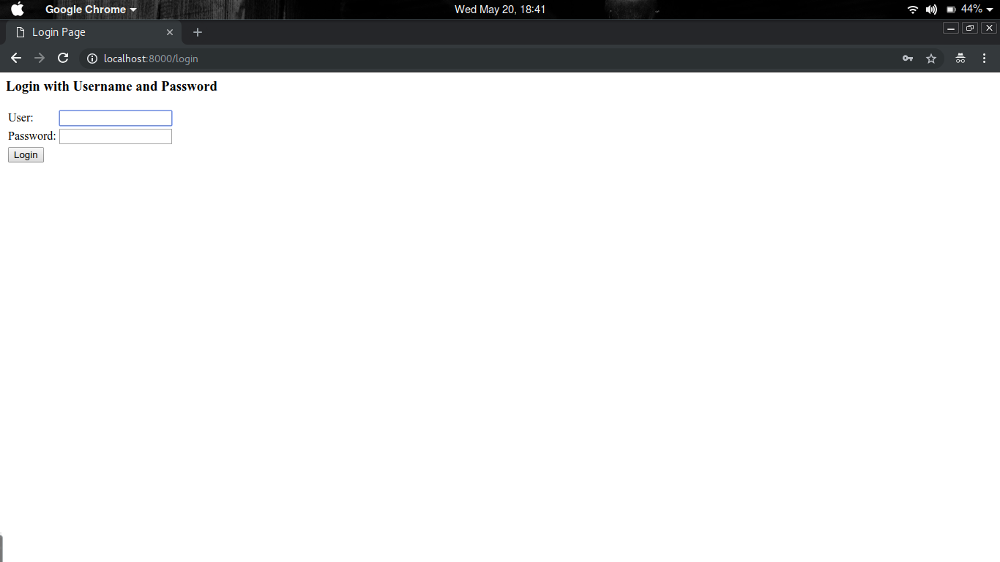

# Spring MVC - Grocery List App
---
Build a Grocery List application using Spring MVC.

 

***Notes:***

- To evaluate the submission, restart the app server and run it on port 8000. 
- When testing, ensure that there is no Grocery data. 
- To run the application, use the `mvn clean tomcat7:run` command or click **Run** (Project menu).
- If the screen lags or freezes, run the test from the terminal using the `mvn test` command.
 

**ExceptionController** : This class must handle all the request errors and log them. If a requested URL displays an error, the error must be printed in the following format:
**Request: {url} raised {exception}**, where **url** is the URL that returns the error, and **exception** is the actual exception or error message.

 

**GroceriesRestController** : A RestController that can be accessed only by an ADMIN user. Must contain the following endpoints:

 
- **/admin/groceries/** - GET - Returns all the grocery items in the memory/database
- **/admin/grocery-list/{user}** - GET - Returns all the grocery items of a particular user. 

**Note**: If a non-authorized user tries to access this page, a ***(403 Forbidden)*** exception must appear. 

 

**GroceryListController**: A controller that can be accessed by users with USER or ADMIN rights. Must contain the following endpoints:

 

- **/list-groceries** - GET - Return the JSP page **list-groceries.jsp** which **contains the grocery list of a user.** 
- **/add-item - GET - Return the JSP page groceries.jsp** which contains a form to enter and submit grocery item data.
- **/add-item** - POST - Add grocery item data to the user's grocery list data, and redirect to the - **list-groceries.jsp** page or **groceries.jsp** page (in case of error).
- **/update-item - GET - Return the JSP page groceries.jsp** which contains a form to update and submit grocery item data.
- **/update-item** - POST - Update the user's grocery list data with grocery item data, and redirect to the **list-groceries.jsp** page or **groceries.jsp** page (in case of error).
- **/delete-item** - GET - Delete a **RequestParam ID** (grocery item) from the user's data.
 

**LogoutController**: A controller that handles user logout. Must contain only one endpoint - - **/logout** of type GET, and enable users to log out of the site and redirect them to **/**.

 

**WelcomeController**: A controller that contains the homepage of a user. Must contain only one endpoint / of type GET, and display a welcome message in the **welcome.jsp** page. **Refer to the images provided below**.

 

**GroceryItem**: This class will be the model of a user's grocery items, and must contain the following fields:

 

- **id** - integer - Automatically calculated (based on existing data).
- user - String - Username of the logged-in user (automatically fetched by the security principal).
- **item** - String - Name of the grocery item (provided by the user).
- **quantity** - int - Quantity required (provided by the user).
- **pricePerUnit** - double - Price for each unit (provided by the user).
- **totalPrice** - double - Automatically calculated by multiplying **quantity** and **pricePerUnit.**

***Note***: In the model class, override the ***HashCode, equals,*** and ***toString*** methods.

 

**SecurityConfiguration:**  Use Spring security to protect the application. Define the configuration such that only the login page is enabled for users who are not logged in. Also, configure authority-based access to **/admin/**** endpoints such that only admin users can access those.

 

Create two user profiles using in-memory authentication:

 

- **User 1:**  **username**: fresco, **password**: play, roles: USER
- **User 2**: **username**: admin, **password**: admin, roles: USER, ADMIN
 

**GroceryListService (optional)**:  This will be the service layer that backs the controllers containing the business logic.

------------------------------------------------------------------------------------------------------------------------------------------------------------------------------------------------------------------------------------------------

Use **log4j** to apply full logging in the project. Configure the **log4j.properties** file such that the application has all levels of logging (INFO, TRACE, DEBUG, WARNING, and ERROR).

Set the properties for **log4j.appender.Appender1, log4j.appender.Appender1.layout, log4j.appender.Appender1.layout.ConversionPattern**

------------------------------------------------------------------------------------------------------------------------------------------------------------------------------------------------------------------------------------------------

Use **Locale** to greet the user on the **welcome** page in their local language. Use **messages_en.properties** and **messages_fr.properties** to specify messages.

------------------------------------------------------------------------------------------------------------------------------------------------------------------------------------------------------------------------------------------------

 

**Views**

 

- **common/header.jspf:** Contains the header of the application (page headers, styling info, and scripts) and is included in other views.
- **common/footer.jspf:** Contains the footer of the application (page footers and scripts) and is included in other views.
- **common/navigation.jspf:** Contains the navigation menu bar of the application and is included in other views. The navigation bar anchors are:
  - Fresco- Redirects to **http://play.fresco.me**
  - Home- Redirects to **/**
  - Groceries- Redirects to **/list-groceries**
  - Logout- Redirects to **/logout**
 

- **error.jsp**: Error page that is displayed whenever an error occurs.

- **groceries.jsp:** Contains the form where users enter new grocery item details or update existing grocery item details. It has the following fields:
  - Input element **item** to enter item name.
  - Input element **quantity** to enter item quantity.
  - Input element **pricePerUnit** to enter item price.
  - Read-only input element **totalPrice** which automatically calculates the total price by multiplying **quantity** with **pricePerUnit**.
- **list-groceries.jsp**: Displays all the grocery list items of a user in table format. The **Add** button enables a user to add new items. Existing items are displayed along with **Edit** and **Delete** anchor tags. Clicking either **Add** or **Edit** must redirect to a **groceries.jsp** page (no data or preloaded data).
- **login.jsp**: Contains username and password fields to enable users to log in to the site. 
- **welcome.jsp**: The home page of the user that contains the navigation menu and a welcome message.
 

***Note:*** For better design, use ***jQuery*** and ***Bootstrap. Refer to the images provided below.***

 

**Login Page**

 

 

**Invalid Login Attempt**

 

 

 

**Home Page**

 

 

**Grocery List without Items**

 

 

**Add Grocery Item**

 

 

**Grocery List with Data**

 

 

 

**Accessing Admin Rest Endpoint without ADMIN access**

 

 

 

**Accessing Admin Rest Endpoint as ADMIN**

 

